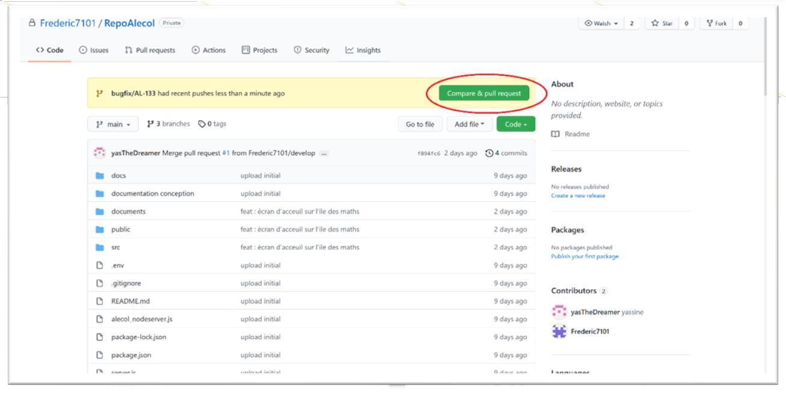

# Gestion du projet Alécol avec Git

## Introduction

Git est un logiciel de gestion de versions décentralisé, qui nous permet de sauvegarder les différentes versions du projet Alécol mais ce qui nous intéresse
c’est surtout que Git permet de faciliter la collaboration à écrire le code source et à le maintenir.

## Git Workflows

Un workflow Git est une recette ou une recommandation sur la façon d'utiliser Git pour accomplir un travail de manière cohérente et productive.

### Quel intérêt ?

Souvent quand on commence à travailler seul sur un projet on ne voit pas l’utilité de suivre une liste de règles pour gérer le code source, et à fur et
mesure que le projet évolue on aperçoit qu’on a besoin de d’autres ingénieurs pour livrer à temps. Ce qui pose problème c’est que si on ne définit pas une
liste de règles à suivre par les Ingénieurs, le code source du projet peut subir des conflits et deviens très vite « non maintenable ».

### Gitflow Workflow

#### Qu’est-ce que c’est ?

GitFlow est un workflow permettant d’établir une stratégie de base sur la création des branches. Git Flow permet de gérer le travail collaboratif pour
gérer les **bugs**, les **features** (nouvelles fonctionnalités) et les **releases** (versions).

C’est le workflow qui a été adopté par l’ensemble des Ingénieurs de Alécol.

#### Principes de base

Pour simplifier, le fonctionnement est basé sur 5 branches : **main, release, develop, feature, hotfix** mais nous ajoutant une 6éme branche qui concerne
les bugs qu’on va appeler **bugfix**.

Si plusieurs personnes travaillent sur les branches **main** et **develop**, l’historiques des réalisations (commits) peut vite devenir illisible et les
modifications risquent de se court-circuiter (conflits).

L’idée est donc de créer des sous-niveaux de branches :

- Les branches **feature/xxxx** permettent de travailler sur des nouvelles fonctionnalités. Elles sont créés directement à partir de la branche *develop* et
une fois le travail fini, fusionnées vers la branche *develop*.
- Les branches **release/xxxx** permettent de faire une mise à jour de la branche *main* à partir de la branche develop. Donc aucune nouvelle fonctionnalité
ne peut être ajoutée après ce point - seules les corrections de bugs, la génération de documentation et d'autres tâches orientées vers la publication
devraient aller dans cette branche.
- Les branches **bugfix/xxxx** permettent de corriger les bugs. Et selon le cas peuvent étre créés directement à partir de *develop* ou de *release*. Et une
fois le travail fini, fusionnées vers la branche de création.
- Les branches **hotfix/xxxx** permettent de publier rapidement (hot) une correction (fix) depuis la branche *main*. Ces branches seront ensuite fusionnées
vers la branche *main* et *develop*.
- **Les conventions d’appellation :**
    - Les noms des branches *main* et *develop* restent fixes et sont créés une seul fois pendant toute la durée du projet.
    - Les branches de type *release* sont nommées suivant cette règle :
        - **release/`<numéro_version>`**
        - Les numéros de version se composent de 3 numéros séparés par un point : **MAJEUR.MINEUR.CORRECTIF** 
        **MAJEUR** : on incrémente quand les modifications apportées créent des incompatibilités avec la version précédente. 
        **MINEUR** : on incrémente quand les modifications apportés sont compatible avec la version précédente ET une ou plusieurs fonctionnalités ont été
        ajoutées.
        **CORRECTIF** : on incrémente quand les modifications apportées sont compatibles avec la version précédente ET il n'y a aucune fonctionnalité
        ajoutée par rapport à la version précédente. Exemple : **release/0.1.0**
    - Les autres branches sont nommées suivant cette règle : `<type_branche>/<identifiant_ticket_jira>` 
    Exemple : **feature/AL-130**

### Commandes Git

Avant de pouvoir manipuler des commandes git, il faut bien évidemment installer git sur sa machine :
- Récupérer le projet :
    - `git clone «lien vers la repository distante»`
- Se positionner sur develop :
    - `git checkout develop`
- Créer une nouvelle branche locale :
    - `git checkout -b «type_branche»/«numéro_ticket_jira»`
- Vérifier ce qui va étre publier:
    - `git status`
- Ajouter ces changements pour la publication :
    - `git add .`
- Valider ces changements avant de publier :
    - `git commit -m «message_du_commit»`
- Publier les modifications :
    - `git push –set-upstream origin «type_branche»/«numéro_ticket_jira»`

### Fusion du code (Pull Request)

Quand une branche est créé et que le travail est finalisé, la prochaine étape est de publier ce travail sur Github. Après la publication sur la branche
distante on doit avertir le chef de projet qu’il y a un nouveau code à fusionner avec *develop* (ou *release*), donc dans ce cas on crée ce qu’on appelle
un Pull Request via le site Github.

Il faut donc cliquer sur **Compare & pull request**.

Il faut par la suite s’assurer qu’on va fusionner soit avec *develop* (si c’est une *feature* ou une *bugfix*) , avec *release* (si c’est une *bugfix*),
ou bien avec *main* et *develop* (si c’est une *release*).

Il faut vérifier que l’étiquette « **Able to merge** » est affichée sinon il faut corriger les conflits de code avant de fusionner.

Il faut aussi cliquer sur **Request** pour que le chef de projet soit notifié de la demande de fusion.

Si les 3 conditions précédentes sont remplies, vous pouvez dans ce cas cliquer sur **Create pull request**.

Le plus important c’est de ne jamais cliquer sur **Merge pull request**, cette étape est réalisé par le Superviseur/Chef de projet après avoir vérifié le
code et après avoir corriger tout conflit.

